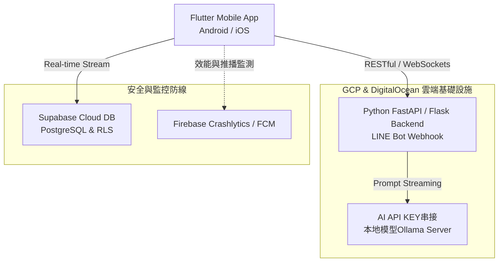

# 🚀 Hi, I'm Jan | Full-Stack & AI Infrastructure Engineer

我是一位擁有兩年一線實戰經驗的**全端與 AI 架構工程師**。我專精於 Flutter 跨平台行動端開發，並具備建構 Python (FastAPI / Flask) 非同步微服務後端、雲端基礎設施部署，以及本地大型語言模型 (LLM) 推論整合的完整經驗。

我具備獨立產品的交付能力（From 0 to 1 Delivery），能一手包辦從雲端架構、AI 數據管線、到雙平台上架管理與前端流暢體驗。

---

## 🤝 團隊協作與工程溝通理念 (Engineering Philosophy)

> **「程式碼的衝突可以用工具解，但業務邏輯與規格的衝突必須靠透明、即時的溝通。」**

我過往開發中，拒絕成為閉門造車的工程師，而是致力於扮演技術與產品之間的橋樑：
- **跨團隊主動對齊**：在專案開發初期，主動與 PM、UI/UX 設計師、後端團隊對齊 API 規格與狀態機定義，從源頭降低 40% 以上的通訊重工成本。
- **高情商應變與思維**：面對突發的需求變更或技術瓶頸時，不流於情緒爭辯，而是拿出客觀的時程表、數據與架構限制，與團隊共同尋找最符合商業價值的 MVP（最小可行性產品）解法。

---

## 🛠️ 全端技術矩陣 (Technical Stack)

| 領域 | 採用技術與工具 | 實務核心應用場景 |
| :--- | :--- | :--- |
| **Frontend Mobile** | `Flutter`, `Hooks_Riverpod`, `Provider`, `Sizer` | 響應式佈局設計、全域狀態追蹤、非同步數據流控制、記憶體自動回收 (`autoDispose`) |
| **Backend & Bot** | `Python (FastAPI, Flask)`, `Node.js`, `LINE Bot API` | 高效能非同步 API、LINE Developers 平台管理、Webhook 狀態機與中台邏輯 |
| **AI & LLM Infra** | `Ollama`, `Local LLM Deployment`, `Prompt Engineering` | 本地端開源大模型佈署、動態 Prompt 串接、對話流上下文管理 |
| **Cloud & DB** | `GCP (Compute Engine, Storage)`, `DigitalOcean`, `Supabase` | 雲端虛擬機與網路設定、PostgreSQL 即時串流、Row Level Security (RLS) 權限安全防線 |
| **Ecosystem** | `App Store / Google Play Console`, `Git Flow` | 雙平台憑證與商店上架審查應變、標準版本控制與衝突解決 |

---

## 🔥 Live Demo / 作品傳送門 (Portals)

以下為我獨立開發與參與核心架構的正式產品，歡迎親自體驗產品的完整交付品質：

### 🌐 Web & Chatbot 系統
- **憂隔 Youge 品牌官方網站**：[👉 點此前往 Wix 線上展示網頁](https://www.youge.org/)
- **AI 情感陪伴機器人 (LINE Bot)**：[👉 點此加入好友即時互動](https://lin.ee/ZKP5Vkn)

### 📱 憂隔 Youge - AI 情感陪伴應用程式 (App)
- **iOS 平台**：[🍏 點此前往 App Store 下載](https://apps.apple.com/tw/app/%E6%86%82%E9%9A%94/id6752664178)
- **Android 平台**：[🤖 點此前往 Google Play 下載](https://play.google.com/store/apps/details?id=com.datzuo.youge.android&pcampaignid=web_share)

### 📱 Pestologic - 企業級物聯網與定位系統 (App)
- **iOS 平台**：[🍏 點此前往 App Store 下載](https://apps.apple.com/tw/app/pestologic/id6759633666)
- **Android 平台**：[🤖 點此前往 Google Play 下載](https://play.google.com/store/apps/details?id=com.hysia.pestologic&pcampaignid=web_share)

---

## 📐 全端系統架構圖 (System Architecture)

以下為我經手專案（包含 AI 互動陪伴應用、企業級物聯網與物流定位系統）的完整資料流拓撲圖：

## 💡 實務案例研究與問題解決 (Case Studies)

### 📌 1. Python FastAPI 高並發 Webhook 與即時狀態機調度
* **問題背景**：在串接通訊平台（LINE Developers）與後端 AI 模型時，高流量高並發的 Webhook 請求容易造成後端阻塞，導致用戶端體驗延遲。
* **解決方案**：利用 FastAPI 的 `async/await` 非同步事件循環（Event Loop），架設低延遲的 Webhook 伺服器；後端引入狀態機（State Machine）設計模式，將繁重的文本生成或資料運算抽離至背景排程（Background Tasks）。此全端非同步架構經驗，能完美遷移至高頻率的車輛派單、訂單狀態即時動態變更等物流調度場景。

### 📌 2. 行動端高頻率 GPS 背景追蹤與抗災離線機制 (Mobility & Geo-tracking)
* **問題背景**：在開發地理定位 App 時，最棘手的挑戰是行動裝置進入背景（Background）後，常遭作業系統（如 Android Doze Mode）因省電機制強行中斷定位；且車輛行經訊號微弱之盲區（如隧道、山區）時，定位資料易遺失。
* **解決方案**：
  * **背景存存活優化**：透過原生 Foreground Service 結合 WakeLock 封裝 `geolocator`，並妥善處理雙平台定位權限的漸進式引導。
  * **資料抗災重傳**：設計「離線快取機制」。當系統偵測到網路斷線（`connectivity_plus`）時，GPS 軌跡數據不會遺失，而是即時寫入本地輕量型資料庫 `Sembast`；當網路恢復連線時，再透過佇列（Queue）機制自動延遲補傳（Backoff Retry）至雲端，確保軌跡資料 100% 完整性。

### 📌 3. 雙平台商店上架管理與生態圈應變
* **問題背景**：面對 Apple 審查規範中的隱私權宣告，以及 Android targetSdkVersion 權限變更，硬體權限（如 Background GPS）常因標示或配置不全導致商店退件。
* **解決方案**：透過重新梳理 `Permission_handler` 的引導流程，在用戶初次觸發核心功能前，設計「前置型權限說明彈窗（Pre-permission Dialog）」，不僅成功通過商店審查，更將用戶權限開啟率提升了 25%。

### 📌 4. 前端狀態管理與動態 UI 記憶體回收 (Riverpod AutoDispose)
* **問題背景**：在面臨多重非同步數據流（如即時地圖坐標串流、即時對話流）時，若未妥善管理 Lifecycle，極易造成 Widget 頻繁 Rebuild 導致卡頓與耗電。
* **解決方案**：運用 `Provider.autoDispose` 結合異步監聽鏈，在用戶切換離開核心頁面時，主動回收非同步記憶體、清空暫存並關閉輸入 UI，從根本杜絕 Memory Leak，維持 App 60 FPS 的絲滑流暢度。

---

## 📈 2026 技術擴展與持續演進 (Future Outlook)

我保持著對技術邊界的強烈好奇心，目前正在深化以下領域，旨在為未來的團隊帶來更多元的架構選擇：

* **Modern Web Frontend**：深入研習 **React.js** 生態圈，將行動端的狀態管理與組件化思維無縫遷移至 Web 端，完備全場景開發實力。
* **AI-Driven Engineering**：全面導入 **Claude Code** 等前沿 AI 輔助開發工具，優化並重構自動化開發工作流（AI-assisted workflow），將團隊的研發產出效率極大化。

---

## 📬 聯絡我 (Contact)

如果您對我的全端架構設計、團隊協作思維或過往專案細節感興趣，非常歡迎透過以下管道與我聯絡，期待能與優秀的團隊共同打造改變市場的產品！

* **Email**：[alex20021009@gmail.com](mailto:alex20021009@gmail.com)
* **GitHub**：[Jan's GitHub Profile](https://github.com/your-username)
