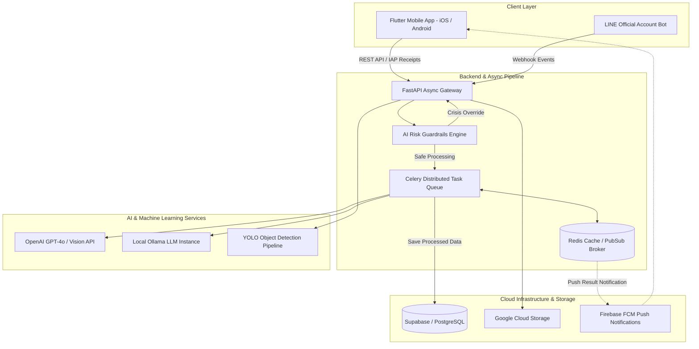

```markdown
# Jan | AI Product Engineer & Full-Stack Developer

AI Product Engineer specializing in cross-platform mobile application development (Flutter) and scalable cloud backend systems (Python / FastAPI / GCP). Experienced in end-to-end (0 to 1) product execution, high-concurrency LLM pipeline architectures, custom AI safety guardrails, and commercial subscription integrations.

Focusing on product-minded engineering, bridging technical execution with business value, and leveraging AI workflows to maximize deliverable velocity and system robustness.

---

## Technical Stack

| Domain | Core Technologies & Tools | Engineering Scope |
| :--- | :--- | :--- |
| **Mobile & Frontend** | Flutter, Dart, Hooks_Riverpod, Rive, Provider | Cross-platform iOS/Android development, 60fps vector state-machine animations, state management, asynchronous memory cleanup (`autoDispose`) |
| **Backend & Microservices** | Python (FastAPI), Celery, Redis, LINE Messaging API | Asynchronous REST APIs, distributed task queue decoupling, Redis Pub/Sub real-time streaming, Webhook state machines |
| **AI Systems & Safety** | OpenAI API (GPT-4o / Vision), Ollama, YOLO, Guardrails | Custom three-stage AI risk filtering engines, multimodal analysis, edge object detection, local LLM orchestration |
| **Cloud, Database & DevOps** | GCP (Compute Engine, GCS), DigitalOcean, Supabase, Docker, Cloudflare | Cloud infrastructure maintenance, PostgreSQL schema design, Firebase Auth / FCM, DNS security management |
| **Monetization & Ecosystem** | Apple StoreKit, Google Play Billing, Git Flow, App Store Connect | In-App Purchase (IAP) integration, server-side receipt validation, enterprise developer account operations, CI/CD branching |

---

## Production Deployments

### Youge (AI Mental Wellness Platform)
End-to-end B2C mobile application featuring custom AI safety guardrails, asynchronous audio/text processing, and 60fps vector animations.
- **Brand Website**: [youge.org](https://www.youge.org/)
- **iOS App Store**: [Download on App Store](https://apps.apple.com/tw/app/%E6%86%82%E9%9A%94/id6752664178)
- **Google Play Store**: [Download on Google Play](https://play.google.com/store/apps/details?id=com.datzuo.youge.android&pcampaignid=web_share)
- **LINE Official Account (Ah-Hao AI)**: [Add Friend](https://lin.ee/ZKP5Vkn)

### Pestologic (B2B Enterprise Field Management)
Enterprise operational mobile application featuring offline-first data protection, GCP microservices, and YOLO computer vision for field inspection.
- **iOS App Store**: [Download on App Store](https://apps.apple.com/tw/app/pestologic/id6759633666)
- **Google Play Store**: [Download on Google Play](https://play.google.com/store/apps/details?id=com.hysia.pestologic&pcampaignid=web_share)

---

## System Architecture


```mermaid
graph TD
    subgraph Clients [Client Layer]
        App[Flutter Mobile App - iOS / Android]
        LineBot[LINE Official Account Bot]
    end

    subgraph BackendLayer [Backend & Async Pipeline]
        API[FastAPI Async Gateway]
        Guard[AI Risk Guardrails Engine]
        Celery[Celery Distributed Task Queue]
        Redis[(Redis Cache / PubSub Broker)]
    end

    subgraph AIEngine [AI & Machine Learning Services]
        OpenAI[OpenAI GPT-4o / Vision API]
        Ollama[Local Ollama LLM Instance]
        YOLO[YOLO Object Detection Pipeline]
    end

    subgraph Infrastructure [Cloud Infrastructure & Storage]
        SupaDB[(Supabase / PostgreSQL)]
        GCS[Google Cloud Storage]
        Push[Firebase FCM Push Notifications]
    end

    App -- REST API / IAP Receipts --> API
    LineBot -- Webhook Events --> API
    
    API --> Guard
    Guard -- Safe Processing --> Celery
    Guard -- Crisis Override --> API
    
    Celery <--> Redis
    Celery --> OpenAI
    Celery --> Ollama
    API --> YOLO

    Celery -- Save Processed Data --> SupaDB
    API --> GCS
    Redis -. Push Result Notification .-> Push -.-> App

```

---

## Technical Case Studies

### 1. High-Concurrency LLM Queue Decoupling & Custom Safety Guardrails

* **Context**: B2C LLM-driven applications encounter severe HTTP timeout issues during prolonged inference (text/audio/image generation) under high concurrency. Additionally, strict safety guidelines are required for crisis detection in mental health scenarios.
* **Engineering Solution**:
* **Custom Guardrail Engine**: Architected a "3-Stage 5-Factor" risk classification pipeline using regex pre-filters, moderation APIs, and contextual evaluation models to execute real-time safety intercepts and route high-risk inputs to emergency support resources.
* **Asynchronous Decoupling**: Offloaded intensive LLM routines to **Celery Task Queues** managed by **Redis**, pushing completed payloads back to client applications via **Redis Pub/Sub** to eliminate HTTP gateway bottlenecks.


### 2. Offline-First Architecture & Computer Vision Integration

* **Context**: Field technicians operating in connectivity-blind environments (e.g., basements) experienced critical data loss under web-based sessions. Inspections also required manual pest counting, leading to operational friction.
* **Engineering Solution**:
* **Offline Data Resilience**: Built a local-first SQLite and caching strategy within the Flutter client. When network connection drops, offline mutations are stored locally and synchronized back to PostgreSQL servers via exponential backoff retry queues upon reconnection.
* **Edge AI Integration**: Integrated YOLO object detection algorithms into the backend pipeline to calculate pest density automatically from camera capture, improving field report efficiency by 40%.


### 3. Vector State Machine Rendering & Memory Lifecycle Optimization

* **Context**: Heavy usage of traditional MP4 or GIF animations caused severe frame drops, thermal throttling, and memory leaks on lower-tier mobile devices.
* **Engineering Solution**:
* **Rive State Machines**: Replaced traditional video rendering with vector-based Rive state machines, decreasing asset package sizes by 80% while locking rendering performance at 60fps.
* **Automated Cleanup**: Implemented `Hooks_Riverpod` with `autoDispose` providers to release stream subscriptions and unmount heavy controllers upon route destruction, preventing memory leaks.


### 4. Cross-Platform Monetization & Server-Side Verification

* **Context**: Implementing recurring subscription models across iOS and Android platforms requires strict receipt validation and handling of asynchronous billing events (renewals, cancellations, grace periods).
* **Engineering Solution**:
* Integrated iOS StoreKit and Google Play Billing flows directly inside Flutter.
* Built server-side webhook endpoints within FastAPI and Supabase to validate platform purchase receipts, ensuring secure privilege allocation and automated subscription lifecycle management.


---

## Ongoing Technical Focus

* **AI-Native Engineering Workflows**: Leveraging AI agents (Cursor, Claude Code, MCP) to establish automated refactoring and testing pipelines, maximizing single-developer leverage.
* **Modern Web Ecosystem Expansion**: Extending state management and system architecture paradigms into React.js and Next.js for web applications.

---

## Contact Information

* **Email**: alex20021009@gmail.com
* **GitHub Profile**: [github.com/lai-jhinyan](https://www.google.com/search?q=https://github.com/lai-jhinyan)

```

```
